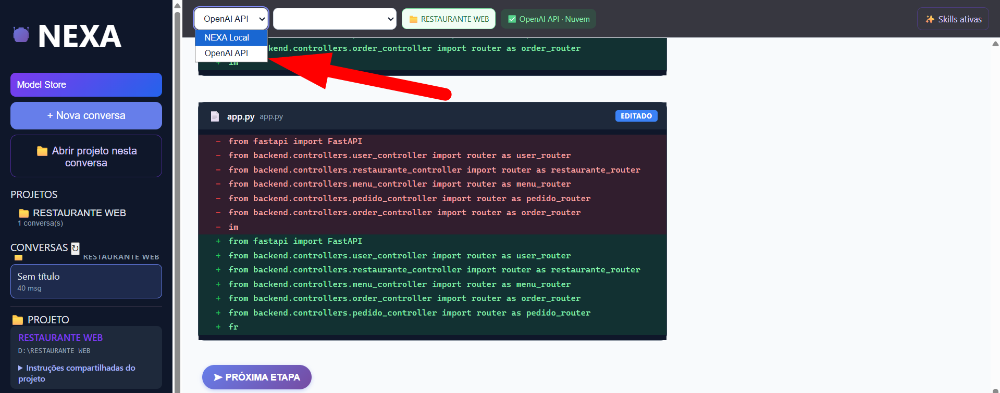
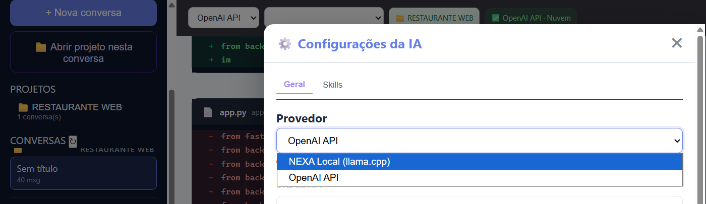
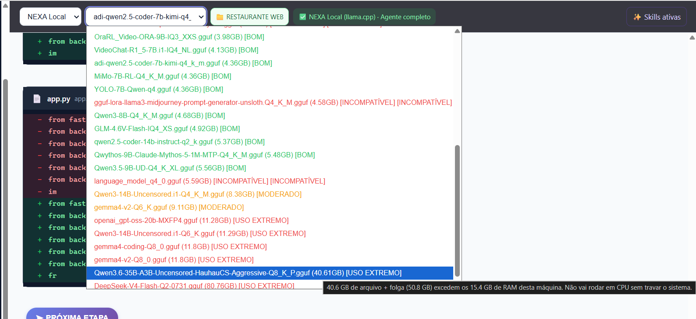
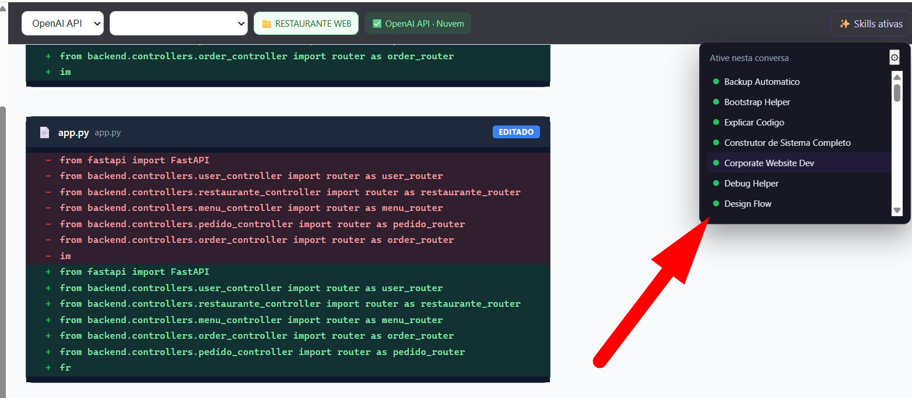
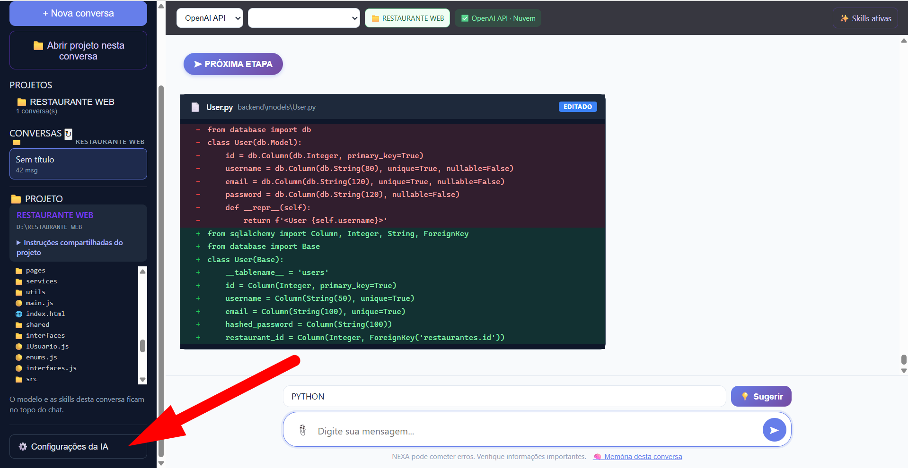
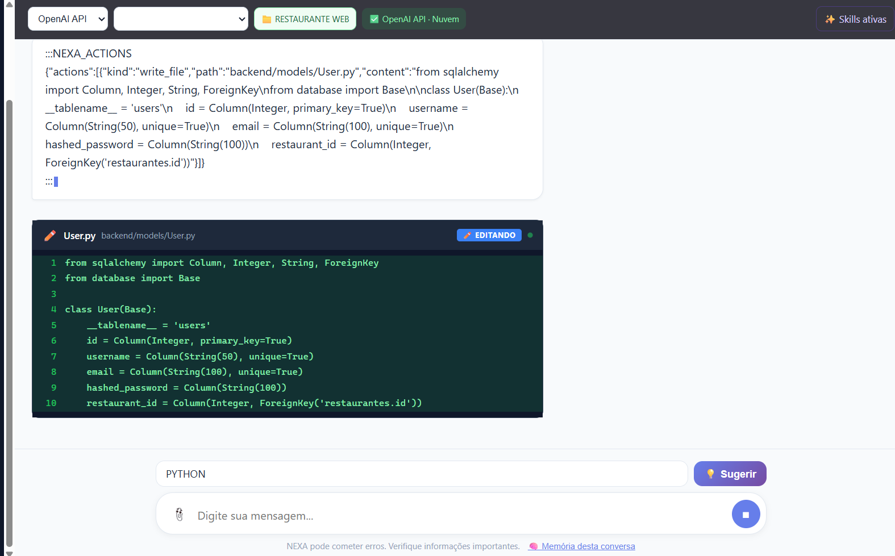
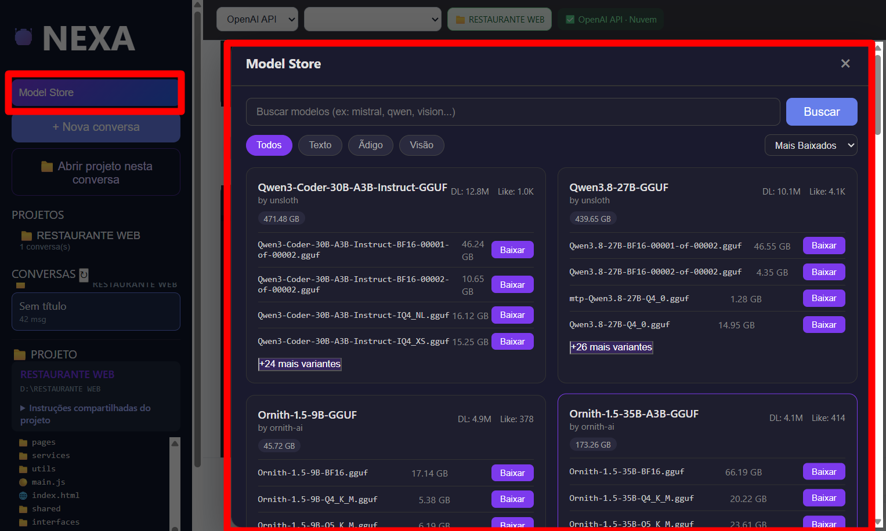
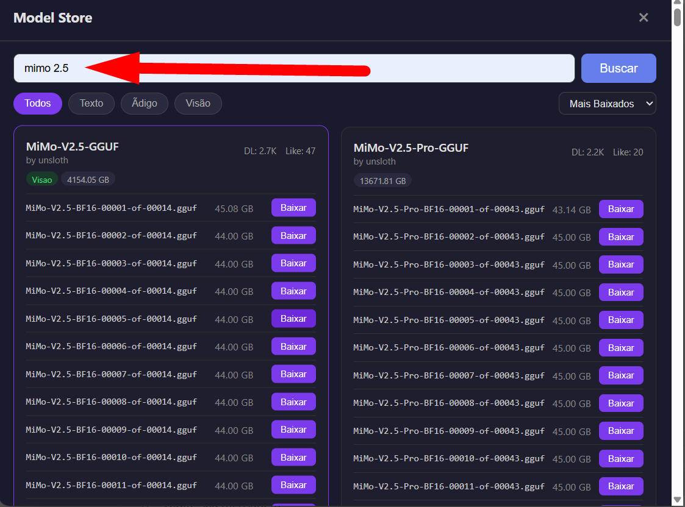
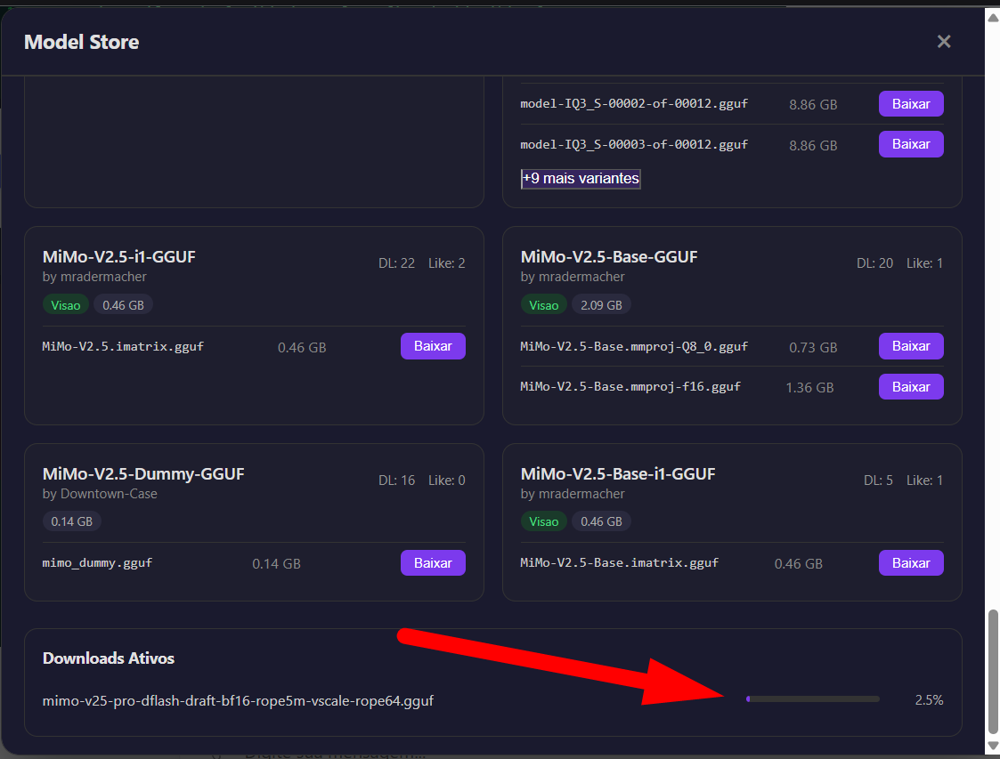

# NEXA AI

**Um agente de IA para desenvolver projetos, com modelos locais e uma linguagem própria em evolução.**

O NEXA AI interpreta pedidos em linguagem natural e oferece ferramentas para analisar código, criar e editar arquivos e executar ações de desenvolvimento. A IA trabalha com o contexto do projeto; o NEXA organiza conversas, memória, modelos e execução das ações.

O projeto começou a ser desenvolvido há pouco tempo e ainda precisa de melhorias, testes e amadurecimento. Abrimos o repositório para compartilhar conhecimentos e construir o NEXA junto com a comunidade, com a intenção de mantê-lo aberto para todos. Código, documentação, sugestões e relatos de experiência são bem-vindos.

## Veja o NEXA em funcionamento

As dez capturas estão abaixo, organizadas por funcionalidade. Clique em uma imagem para ampliá-la.

### 1. O agente trabalhando no projeto

O NEXA reúne conversas, pasta do projeto e alterações de código na mesma interface. Nesta captura, o provedor na nuvem está ativo e o aplicativo apresenta as mudanças em `app.py`, com trechos removidos em vermelho e adicionados em verde.

### 2. Alternar entre IA local e nuvem

O seletor no topo da conversa permite alternar entre **NEXA Local** e **OpenAI API**. O modelo local precisa estar disponível e a API externa precisa estar configurada para o uso correspondente.

### 3. Configurações da IA

Na aba **Geral**, o campo **Provedor** permite escolher **NEXA Local (llama.cpp)** ou **OpenAI API**. Essa área reúne os ajustes da conexão com a IA.

### 4. Modelos locais e adequação ao computador

A lista apresenta os modelos GGUF encontrados, seus tamanhos e classificações como **BOM**, **MODERADO**, **USO EXTREMO** e **INCOMPATÍVEL**. O aviso exibido compara a memória estimada com a RAM da máquina.

Essas classificações ajudam a escolher, mas não garantem desempenho nem compatibilidade. Elas se referem ao computador da captura; não são recomendações universais para todos os usuários.

### 5. Skills ativadas por conversa

O menu **Skills ativas** permite habilitar ou desabilitar uma skill com um clique. Assim, o usuário escolhe quais instruções especializadas acompanharão aquela conversa. Na captura, os indicadores verdes identificam as skills ativas.

### 6. Onde abrir as configurações

O botão **Configurações da IA** fica na parte inferior da barra lateral. A seta na imagem indica o acesso. O projeto e o histórico de alterações permanecem visíveis na tela principal.

### 7. Agente em ação com API na nuvem

O indicador **OpenAI API · Nuvem** mostra o provedor selecionado. O NEXA apresenta uma ação sobre `backend/models/User.py` e o cartão **EDITANDO**, ilustrando o acompanhamento da edição durante a execução do agente.

### 8. Catálogo do Hugging Face no NEXA

A **Model Store** reúne modelos do Hugging Face dentro do aplicativo. Os cartões mostram o nome, o autor, os arquivos disponíveis e seus tamanhos, com o botão **Baixar** ao lado de cada arquivo. A captura destaca o acesso à loja na barra lateral e o catálogo aberto.

### 9. Buscar modelos

Digite o nome desejado e clique em **Buscar**. Nesta captura, a pesquisa por `mimo 2.5` apresenta resultados e arquivos GGUF. A loja também oferece filtros e ordenação para explorar o catálogo.

A presença no catálogo não garante que o modelo seja compatível com o motor ou adequado ao computador. Alguns resultados contêm partes de modelos ou arquivos auxiliares, que não funcionam isoladamente como uma IA de chat.

### 10. Acompanhar o download

Depois de iniciar um download, a seção **Downloads Ativos** mostra o nome do arquivo e a barra de progresso. A imagem registra uma transferência em **2,5%**, demonstrando o acompanhamento dentro do próprio NEXA.

Essa captura mostra o download em andamento, não sua conclusão nem o carregamento do modelo. Após terminar, selecione um modelo de chat compatível para utilizá-lo localmente.

## Modelos locais

O NEXA consulta o Hugging Face e baixa modelos GGUF para uso local. No pacote desktop completo, **llama.cpp vem integrado**, dispensando a instalação de um servidor de IA separado. Baixe um modelo compatível, selecione a IA e aguarde o carregamento. O NEXA aplica os parâmetros de execução automaticamente.

A interface apresenta estimativas de adequação ao computador. Elas ajudam na escolha, mas não são benchmarks: memória disponível, tamanho do modelo, contexto e compatibilidade do motor influenciam o resultado. Nem todo GGUF é um modelo de chat compatível.

**Disponibilidade:** em 14/09/2026, ainda não havia instalador publicado nas [Releases](https://github.com/WAGNERMBBRAGA/NEXA/releases). O clone contém código; modelos, executáveis e dependências de build não são versionados. Veja o [guia de desenvolvimento](docs/DEVELOPER_GUIDE.md) para executar a partir do código.

## Documentação

- [Guia do usuário](docs/GUIA_DO_USUARIO.md)
- [Solução de problemas](docs/SOLUCAO_DE_PROBLEMAS.md)
- [Guia de desenvolvimento](docs/DEVELOPER_GUIDE.md)
- [Como contribuir](CONTRIBUTING.md)
- [Visão e evolução](docs/VISAO_E_EVOLUCAO.md)
- [Índice completo](docs/INDEX.md)

## O agente hoje e a linguagem no futuro

O agente é a aplicação atual do NEXA AI. O repositório também contém uma toolchain experimental em Rust, com compilador, runtime e ferramentas para a linguagem NEXA. A visão é evoluir para uma linguagem universal capaz de expressar intenções e atender diferentes tecnologias e ambientes.

Essa universalidade é uma direção de pesquisa, não uma funcionalidade pronta. A presença do compilador não significa integração completa com o agente. A execução das tarefas depende do modelo escolhido e precisa ser conferida pelos resultados reais.

## Licença

A intenção é manter o projeto aberto à comunidade. Entretanto, [LICENSE](LICENSE) ainda é um marcador de licença indefinida e não concede uma licença de uso ou redistribuição. A formalização dos termos permanece pendente; esta documentação não altera a licença.
