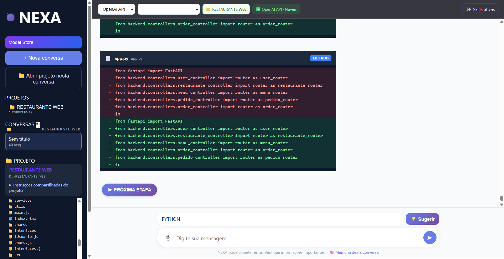

# NEXA AI

**Um agente de IA para desenvolver projetos, com modelos locais e uma linguagem própria em evolução.**

O NEXA AI interpreta pedidos em linguagem natural e oferece ferramentas para analisar código, criar e editar arquivos e executar ações de desenvolvimento. A IA trabalha com o contexto do projeto; o NEXA organiza conversas, memória, modelos e execução das ações.

O projeto começou a ser desenvolvido há pouco tempo e ainda precisa de melhorias, testes e amadurecimento. Abrimos o repositório para compartilhar conhecimentos e construir o NEXA junto com a comunidade, com a intenção de mantê-lo aberto para todos. Código, documentação, sugestões e relatos de experiência são bem-vindos.

## Veja o NEXA em funcionamento

O agente pode trabalhar com IA local ou API na nuvem. A interface permite alternar provedores, consultar a adequação dos modelos ao computador e habilitar ou desabilitar skills por conversa com um clique.

**[Veja a galeria com as sete telas explicadas](docs/GALERIA.md)** — projetos, configurações, modelos, skills e edição com API na nuvem.

## Modelos locais

O NEXA consulta o Hugging Face e baixa modelos GGUF para uso local. No pacote desktop completo, **llama.cpp vem integrado**, dispensando a instalação de um servidor de IA separado. Baixe um modelo compatível, selecione a IA e aguarde o carregamento. O NEXA aplica os parâmetros de execução automaticamente.

A interface apresenta estimativas de adequação ao computador. Elas ajudam na escolha, mas não são benchmarks: memória disponível, tamanho do modelo, contexto e compatibilidade do motor influenciam o resultado. Nem todo GGUF é um modelo de chat compatível.

**Disponibilidade:** em 14/09/2026, ainda não havia instalador publicado nas [Releases](https://github.com/WAGNERMBBRAGA/NEXA/releases). O clone contém código; modelos, executáveis e dependências de build não são versionados. Veja o [guia de desenvolvimento](docs/DEVELOPER_GUIDE.md) para executar a partir do código.

## Documentação

- [Guia do usuário](docs/GUIA_DO_USUARIO.md)
- [Solução de problemas](docs/SOLUCAO_DE_PROBLEMAS.md)
- [Guia de desenvolvimento](docs/DEVELOPER_GUIDE.md)
- [Como contribuir](CONTRIBUTING.md)
- [Visão e evolução](docs/VISAO_E_EVOLUCAO.md)
- [Índice completo](docs/INDEX.md)

## O agente hoje e a linguagem no futuro

O agente é a aplicação atual do NEXA AI. O repositório também contém uma toolchain experimental em Rust, com compilador, runtime e ferramentas para a linguagem NEXA. A visão é evoluir para uma linguagem universal capaz de expressar intenções e atender diferentes tecnologias e ambientes.

Essa universalidade é uma direção de pesquisa, não uma funcionalidade pronta. A presença do compilador não significa integração completa com o agente. A execução das tarefas depende do modelo escolhido e precisa ser conferida pelos resultados reais.

## Licença

A intenção é manter o projeto aberto à comunidade. Entretanto, [LICENSE](LICENSE) ainda é um marcador de licença indefinida e não concede uma licença de uso ou redistribuição. A formalização dos termos permanece pendente; esta documentação não altera a licença.
