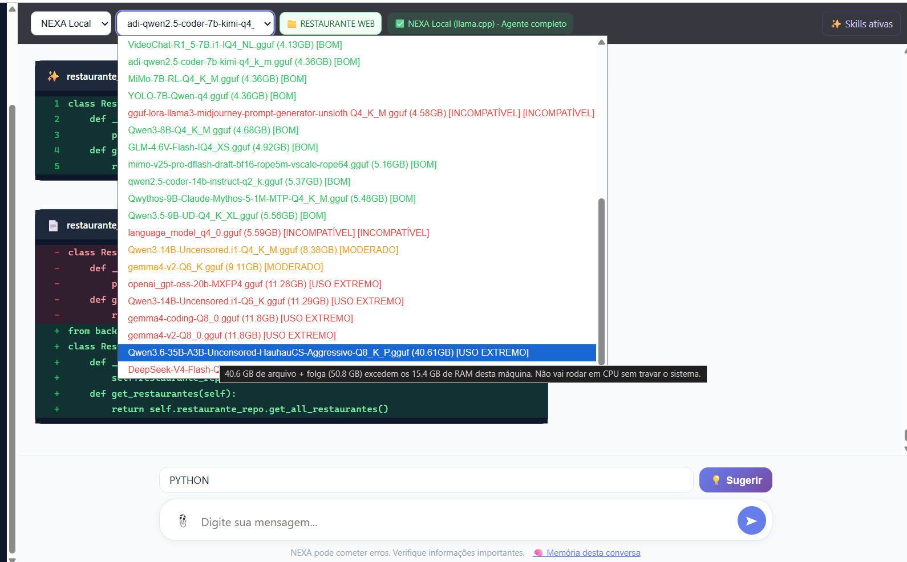
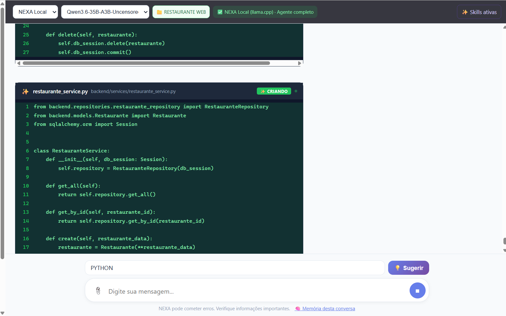

# NEXA AI em imagens

[Apresentação](../README.md) · [Guia do usuário](GUIA_DO_USUARIO.md) · [Índice](INDEX.md)

Capturas fornecidas pelo autor do projeto em 14/09/2026, organizadas por funcionalidade. Clique nas imagens para abrir os arquivos em tamanho original. As telas registram uma sessão de desenvolvimento; não representam uma validação completa do sistema de restaurante exibido.

## 1. O agente trabalhando no projeto

O NEXA reúne conversas, pasta do projeto e alterações de código na mesma interface. Nesta captura, o provedor na nuvem está ativo e o aplicativo apresenta as mudanças em `app.py`, com trechos removidos em vermelho e adicionados em verde.

## 2. Alternar entre IA local e nuvem

O seletor no topo da conversa permite alternar entre **NEXA Local** e **OpenAI API**. O modelo local precisa estar disponível e a API externa precisa estar configurada para o uso correspondente.

## 3. Configurações da IA

Na aba **Geral**, o campo **Provedor** permite escolher **NEXA Local (llama.cpp)** ou **OpenAI API**. Essa área reúne os ajustes da conexão com a IA.

## 4. Modelos locais e adequação ao computador

A lista apresenta os modelos GGUF encontrados, seus tamanhos e classificações como **BOM**, **MODERADO**, **USO EXTREMO** e **INCOMPATÍVEL**. O aviso exibido compara a memória estimada com a RAM da máquina.

Essas classificações ajudam a escolher, mas não garantem desempenho nem compatibilidade. Elas se referem ao computador da captura; não são recomendações universais para todos os usuários.

## 5. Skills ativadas por conversa

O menu **Skills ativas** permite habilitar ou desabilitar uma skill com um clique. Assim, o usuário escolhe quais instruções especializadas acompanharão aquela conversa. Na captura, os indicadores verdes identificam as skills ativas.

## 6. Onde abrir as configurações

O botão **Configurações da IA** fica na parte inferior da barra lateral. A seta na imagem indica o acesso. O projeto e o histórico de alterações permanecem visíveis na tela principal.

## 7. Agente em ação com API na nuvem

O indicador **OpenAI API · Nuvem** mostra o provedor selecionado. O NEXA apresenta uma ação sobre `backend/models/User.py` e o cartão **EDITANDO**, ilustrando o acompanhamento da edição durante a execução do agente.

## 8. Catálogo do Hugging Face no NEXA

A **Model Store** reúne modelos do Hugging Face dentro do aplicativo. Os cartões mostram o nome, o autor, os arquivos disponíveis e seus tamanhos, com o botão **Baixar** ao lado de cada arquivo. A captura destaca o acesso à loja na barra lateral e o catálogo aberto.

## 9. Buscar modelos

Digite o nome desejado e clique em **Buscar**. Nesta captura, a pesquisa por `mimo 2.5` apresenta resultados e arquivos GGUF. A loja também oferece filtros e ordenação para explorar o catálogo.

A presença no catálogo não garante que o modelo seja compatível com o motor ou adequado ao computador. Alguns resultados contêm partes de modelos ou arquivos auxiliares, que não funcionam isoladamente como uma IA de chat.

## 10. Acompanhar o download

Depois de iniciar um download, a seção **Downloads Ativos** mostra o nome do arquivo e a barra de progresso. A imagem registra uma transferência em **2,5%**, demonstrando o acompanhamento dentro do próprio NEXA.

Essa captura mostra o download em andamento, não sua conclusão nem o carregamento do modelo. Após terminar, selecione um modelo de chat compatível para utilizá-lo localmente.

## 11. Seleção de um modelo de grande porte

A captura destaca `Qwen3.6-35B-A3B-Uncensored-HauhauCS-Aggressive-Q8_K_P.gguf`, listado com **40,61 GB**. Nesse momento, o campo superior ainda mostra o modelo anterior: a lista aberta registra a escolha, não comprova por si só o carregamento.

## 12. Trabalho local com o modelo selecionado

Na captura seguinte, o seletor já exibe o nome iniciado por **Qwen3.6-35B-A3B-Uncensored**, com **NEXA Local (llama.cpp)** ativo. A interface acompanha a criação de `backend/services/restaurante_service.py`, mostrando código Python e o estado **CRIANDO**. É o registro visual fornecido pelo autor do NEXA trabalhando com esse modelo local.

### Notebook utilizado

Configuração consultada diretamente no computador em 14/09/2026:

| Componente | Configuração |
|---|---|
| Fabricante e modelo | Positivo Tecnologia SA — N8450 |
| Processador | Intel Core Ultra 5 135H |
| Núcleos e processadores lógicos | 14 núcleos, 18 processadores lógicos |
| Memória instalada | 16 GB, em dois módulos de 8 GB; velocidade informada: 5600 MT/s |
| Memória utilizável informada pelo sistema | Aproximadamente 15,39 GiB |
| Gráficos | Intel Arc Graphics |
| Armazenamento | Dois SSDs NVMe: Micron 3400 de aproximadamente 1 TB e CL4-8D512 de 512 GB |
| Sistema operacional | Windows 11 Pro, 64 bits, build 26100 |

O arquivo de 40,61 GB supera a RAM física deste notebook. As capturas não medem velocidade, memória efetivamente utilizada, paginação ou uso da GPU, nem comprovam a conclusão e os testes do projeto. O aviso de **USO EXTREMO** é uma estimativa do aplicativo; esta demonstração não deve ser interpretada como garantia de execução fluida em qualquer máquina de 16 GB.

## Sobre as imagens

As três remessas somam quinze capturas, das quais doze são únicas. As três repetições da primeira remessa foram identificadas por comparação SHA-256 e não foram incluídas na galeria. Os arquivos publicados preservam o conteúdo e a resolução dos originais, inclusive as marcações adicionadas pelo autor.
